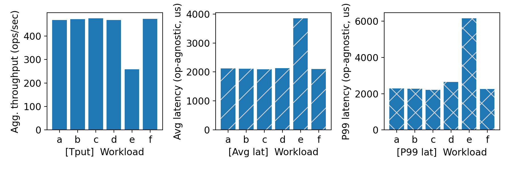
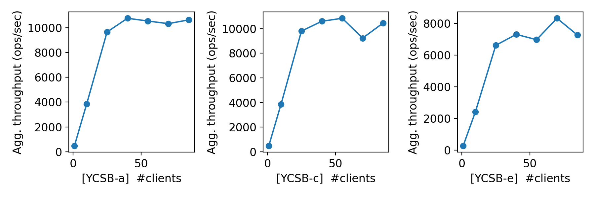
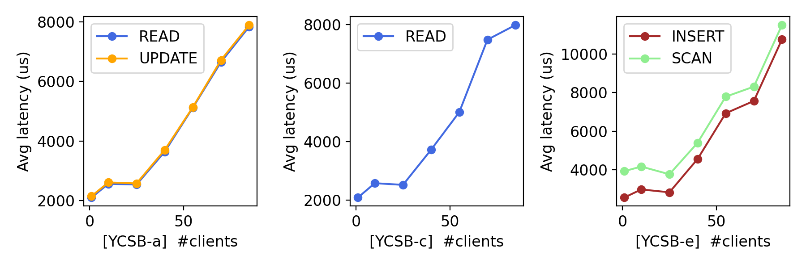
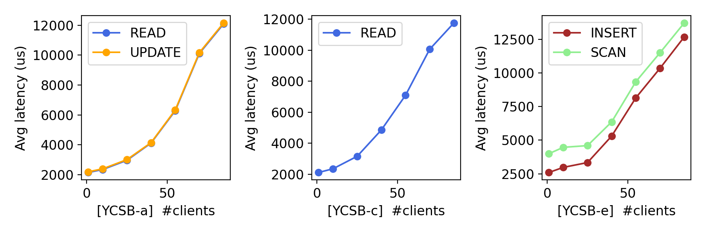
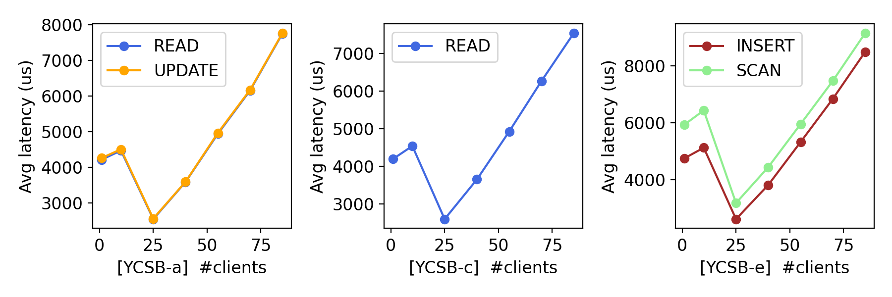

# CS 739 MadKV Project 1

**Group members**: Avinash `kartik3@wisc.edu`, Lekha `lravichandr2@wisc.edu`

## Design Walkthrough

### Code Structure
The codebase consists of a server and client component both communicating via gRPC. The server implements a thread-safe key-value store using a `std::map<string, string>` protected by a `std::mutex` to ensure consistent linearizability. All five RPC operations (Put, Get, Swap, Scan, Delete) acquire an exclusive lock at the start of execution, ensuring atomic, non-interleaving operations across concurrent clients. The client (`KvstoreClient`) establishes a channel to the server and provides synchronous methods to issue RPC calls. Each client request is being serialized through the server's mutex-protected operations.

### Server Design
The server is built on gRPC framework with a synchronous service handler (`KvstoreServiceImpl`) that processes incoming RPC requests. Each operation is protected by mutual exclusion, guaranteeing total ordering of all database modifications. The gRPC server listens on port 50051 with TCP keep-alive enabled to maintain hot channels and avoid delays.

### RPC Protocol

The RPC protocol defines five key operations:
<ul>
<li>Put (insert/update with found flag)
<li>Get (retrieve value)
<li>Swap (atomic exchange returning old value)
<li>Scan (range query returning key-value pairs)
<li>Delete (remove key with found flag). 
</ul> 
All operations use Protocol Buffers for serialization, and each request-response pair is handled synchronously with exclusive database access enforced by mutexes.

#### RPC Specification (Protocol Buffers)

```protobuf
syntax = "proto3";

package kvstore;

service Kvstore {
  rpc Get (GetRequest) returns (GetResponse);
  rpc Swap (SwapRequest) returns (SwapResponse);
  rpc Scan (ScanRequest) returns (ScanResponse);
  rpc Delete (DeleteRequest) returns (DeleteResponse);
  rpc Put (PutRequest) returns (PutResponse);
}

message PutRequest {
  optional string key = 1;
  optional string new_value = 2;
}

message PutResponse {
  optional bool found = 1; 
}

message GetRequest {
  optional string key = 1;
}

message GetResponse {
  optional string value = 2;
} 

message SwapRequest {
  optional string key = 1;
  optional string new_value = 2;
}

message SwapResponse {
  optional string old_value = 2;
}

message ScanRequest {
  optional string start_key = 1;
  optional string end_key = 2;
}

message KeyValuePair {
  optional string key = 1;
  optional string value = 2;
}

message ScanResponse {
  repeated KeyValuePair pairs = 1;
}

message DeleteRequest {
  optional string key = 1;
}

message DeleteResponse {
  optional bool found = 1;
}
```

## Self-provided Testcases

<u>Found the following testcase results:</u> 1, 2, 3, 4, 5

You will run some testcases during demo time.

### Explanations

Testcase 1:
<ul>
<li> Single Client
<li> Tests all possible outcomes for all functionalities.
<li> This test validates that a client can query the keyvalue store in the server and all possible scenarios are covered correctly.
</ul>

Testcase 2:
<ul>
<li> Single Client
<li> Tests the correctness of different scan queries.
<li> This test extensively test the scan query, multiple scan ranges are queries to see if all possible scenarios are covered correctly.
</ul>

Testcase 3:
<ul>
<li> Two Clients
<li> Tests non-conflicting queries, client 1 modifies constantly operates on key1 and client 2 on key2.
<li> This test validates that multiple clients can query the database simultaneousely.
</ul>

Testcase 4:
<ul>
<li> Two Clients
<li> Tests conflicting queries, both clients constantly modify and poll key1.
<li> This tests validates that multiple clients can see the effects of changes made by other clients in real time.
</ul>

Testcase 5:
<ul>
<li> Two Clients
<li> Tests conflicting queries, both clients constantly modify multiple keys and poll them as well.
<li> Client 2 also constantly scans all the keys in the key-value store to ensure that they can see the modified global state in real time.
<li> This tests validates that multiple clients can see the effects of changes made by other clients to all entites in the key-value store in real time.
</ul>

## Fuzz Testing

<u>Parsed the following fuzz testing results:</u>

num_clis | conflict | outcome
:-: | :-: | :-:
1 | no | PASSED
3 | no | PASSED
3 | yes | PASSED

You will run a multi-client conflicting-keys fuzz test during demo time.

### Comments

We used fuzz testing as a primary validation mechanism to ensure consistent linearizable behavior. Initial testing with conflicting operations across multiple clients revealed inconsistency issues from concurrent threads. After implementing mutex-based synchronization locks, all fuzz tests passed, confirming that exclusive locking enforces total ordering of operations and achieves linearizability.


## YCSB Benchmarking

<u>Single-client throughput/latency across workloads:</u>



<u>Agg. throughput trend vs. number of clients:</u>



<u>Avg. latency trend vs. number of clients:</u>



### Comments

Workload specifics:
<ul>
<li> A: Read/update ratio: 50/50 (Write heavy)
<li> B: Read/update ratio: 95/5 (Read heavy)
<li> C: Read/update ratio: 100/0 (Read only)
<li> D: Read/update/insert ratio: 95/0/5 (Read heavy + Inserts)
<li> E: Scan/insert ratio: 95/5 (Range scans)
<li> F: Read/read-modify-write ratio: 50/50 (Write heavy)
</ul>

Discussion:
<ul>
<li> Claims:
<ul>
<li> Since the we have used a map to implement the key-value store on the server side.
<li> Hence, both read and update on a single entity operations have a similar latency.
<li> However, scan has to read a range on keys and hence has a higher latency than the standard read and update.
</ul>
<li> Single clients observations:
<ul>
<li> The above claims can be verified through the plots.
<li> It can also be seen that insert however has a higher tail latency than the standard read and update. 
<ul>
<li> This might be due to collisions in the map, but on average the latency turns out to be similar to the others.
</ul>
</ul>
<li> Throughput observations:
<ul>
<li> As the number of clients increases, the throughput also increases upto a point where the server is constantly processing a request and then plateaus.
<ul>
<li> This is the scalability bottleneck of a single threaded server.
</ul>
<li> The throughput of workload E (range scans) is lesser where as the throughput of worloads A and C (having only standard reads and updates) are similar. This is purely because scans do more work.
</ul>
<li> Latency observations:
<ul>
<li> The latencies of reads and updates are almost the same even as the number of clients increase, thus workloads A and C have similar latencies.
<li> As seen from workload E, the latency of scans are much higher and increase with the number of clients as well.
<ul>
<li> Increasing latency with the number of clients is the scalability bottleneck of a single threaded server.
</ul>
<li> The latencies of insert are higher than reads are updates. This could be due to two factors:
<ul>
<li> The inserts are combined with scans (with a ratio of 5/95), hence increasing the latency as they have to wait for the scans to complete.
<li> There could be collisions in the map, hence inserting could take some more time than a standard upadte.
</ul>
</ul>
</ul>

## Additional Discussion

We were able to optimize the code to increase the throughput <b>1.5x</b> and reduce the latency proportionately.

<u>Avg. latency trend vs. number of clients (without optimization): </u>


The streaming optimization techniques we used are as follows:
<ul>
<li> Disabling Nagle’s Algorithm
<ul>
<li> This is meant to improve network efficiency by reducing the number of small packets sent, buffering them into larger segments before transmission.
<li> This is extremely benefical for large files. However, in a key-value store the messages are very small and it would take a long time to fill the packet.
<li> Thus by disabling this we send each packet immediately without waiting, thereby reducing the latency.
</ul>
<li> Eliminating the cold path problem
<ul> 
<li> A TCP connection becomes idle when no requests have been sent for a while.
<li> We allowed the system to send pings even when no requests were sent, keeping the connection active.
<li> Thus by doing so we avoiding cold starting the connections multiple times.
</ul>
</ul>

We also had an interesting observation while running the benchmark test with the client and server on the same machine.

<u>Avg. latency trend vs. number of clients (clients and server in a single machine): </u>


<ul>
<li> While testing the latency vs number of clients, we noticed that the latency increased till 10 clients and then started decreasing while reaching a minimum around 17 clients.
<li> After digging deeper we found out that this is due to the CPU cold start problem due to underutilization.
<li> With a few clients, not all CPU cores are active and they go back to sleep as well.
<li> Thus when a thread is being processed there is a higher chance it has to wake up a CPU core as well, adding to the latency.
<li> With 17 - 25 clients, it hits a sweet spot between  under and over utilization.
<li> As the numer of clients increases, the CPU cores are now overutilized, thus increasing the latency.
</ul>

## AI Usage
We used ChatGPT in the initial installation phase of the project to install and configure gRPC and Protocol Buffers dependencies, as well as to help us set up CMake, which we hadn't used before. We also used it to understand how to interpret the different workload types at a high level. 