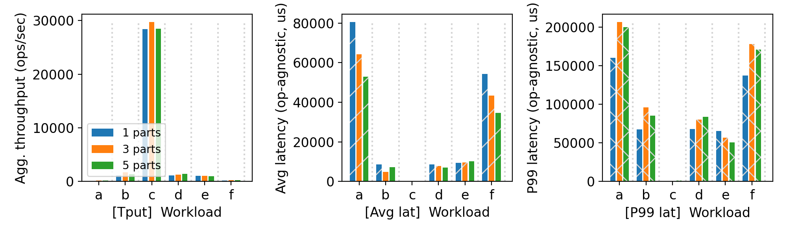
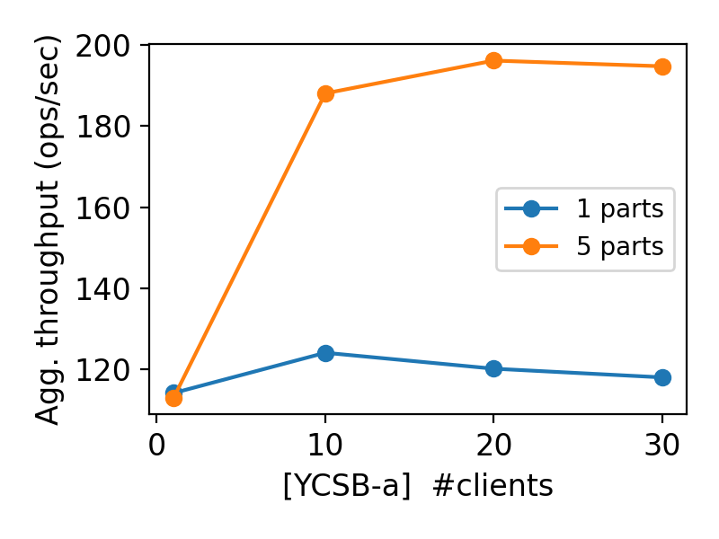

# CS 739 MadKV Project 2

**Group members**: Lekha `lravichandr2@wisc.edu`, Avinash `kartik3@wisc.edu`

## Design Walkthrough

### Code Components Structure
The system consists of three binaries communicating via gRPC:
<ol>
<li> kvstore_manager: This is the cluster registry which is launched first. The manager accepts server registrations and serves cluster info to clients. 
<li> kvstore_server: This handles all KV operations and persists state to RocksDB. 
<li> kvstore_client: This is an interactive client that queries the manager once on startup, then routes all requests directly to the correct server. 
<li> Two proto files define the RPC interfaces - kvstore.proto for KV operations (Put, Get, Swap, Scan, Delete) and manager.proto for cluster management (RegisterServer, GetClusterInfo).
</ol>

### Durability/Recovery Design & Implementation
We use <b>RocksDB</b> as the persistent storage backend. We implement a log-structured approach where instead of persisting the KV map directly, we log every mutating operation (Put, Swap, Delete) as a KeyValuePair <b>protobuf</b> entry with a monotonically increasing counter as the key. Since we are storing the logs as a protobuf, this takes care of serializing and deserializing the data. Delete operations are represented as entries with no value field set.
On startup,
<ul>
<li> RocksDB opens the existing database from the --backer_path directory.
<li> We iterate through all log entries in order, replaying each into the in-memory std::map.
<li> Entries with a value are applied as inserts/updates. Entries without a value are applied as deletes.
<li> The counter is restored from the last entry's key so new writes continue from where we left off. Since the Puts to RocksDB are atomic, we can safely say that the last entry in the log was fully committed and has the latest counter.
</ul>

### Partitioning Design & Manager Implementation
We use hash-based partitioning where each key is routed to a server using hash(key) % num_servers. This gives a uniform distribution across servers.

The manager is a lightweight registry with two responsibilities:
<ol>
<li> RegisterServer - each server calls this on startup, providing its ID and address. The manager stores this in a map and responds with num_servers.
<li> GetClusterInfo - clients call this once on startup to get the full server ID → address mapping. The manager blocks until all servers have registered, ensuring clients only proceed once the cluster is fully up.
</ol>

### Error and Timeout Handling
We have implemented an infinite retry logic at every connection boundary.
<ul>
<li> On startup, the server retries RegisterServer every 500ms until the manager is reachable. This handles the case where the manager is not yet up when servers are launched.
<li> On startup, the client retries GetClusterInfo every 500ms. The manager returns UNAVAILABLE until all servers have registered, so the client waits for the full cluster to be ready.
<li> Every KV operation is wrapped in a CallWithRetry template that retries indefinitely on any RPC failure. 
<li> Since Scan contacts all servers, each server call has its own independent retry loop so that a failure on one server doesn't block results from others indefinitely.
</ul>

## Self-provided Testcase

You will run the described testcase during demo time.

### Explanations

We have created a testcase to simulate crashing and recovery of a server. The testcase monitors how clients handle requests sent to servers that are up and running as well as servers which have crashed. For this purpose, we created 3 server partitions and identied 3 unique keys for each of the partition. All operations are performed on those keys as we can know exactly which partition each key belongs to. We can observe that when a client sends a request to a server which is up and running, it recieves the response immediately. Whereas, when it sends a request to a server which is down, it recieves an error and retries indefinitely.

## Fuzz Testing

<u>Parsed the following fuzz testing results:</u>

num_servers | crashing | outcome
:-: | :-: | :-:
3 | no | PASSED
3 | yes | PASSED
5 | yes | PASSED

You will run a crashing/recovering fuzz test during demo time.

### Comments

The fuzz testing similar to the custom test above allowed us to test how our code worked when a server went down for a while and came up back. The server was able to reciver the state from the persistent storage, the client was able to retry the requests successfully until the server was back up and running and recieved a valid response. Testing with 5 servers allowed us to test what happens when 2 servers went down simultaneously. This was essentially a more comprehensive and exhaustive test compared to what we had written to test the functionalities implemeted were working as intended.

## YCSB Benchmarking

<u>10 clients throughput/latency across workloads & number of partitions:</u>

<u>Agg. throughput trend vs. number of clients w/ and w/o partitioning:</u>

### Comments

#### Set 1: All workloads, 10 clients, 1/3/5 partitions:
<ul>
<li> We ran all all testing and benchmarking on a single machine due to the limited resources avaiable.
<li> Workload C (read-only) dominates throughput by a large margin compared to all other workloads. This is because the reads don't touch RocksDB's write path, don't acquire exclusive locks, and don't sync to disk. 
<li> All workloads involving writes (A, B, D, E, F) show significantly lower throughput because every write requires a synchronous RocksDB sync to disk.
<li> The throughput of workloads B, D and E are slightly better because they are majorly read traffic.
<li> The latency metrics of workload C is very negligible compared to the other workloads.
<li> Write-heavy workloads show significantly higher average and P99 latency, with P99 latency being several times higher than average latency, indicating that tail latency is disproportionately affected by disk sync operations and lock contention under concurrent writes.
</ul>

#### Set 2: Workload A, scaling clients, 1 vs 5 partitions:
<ul>
<li> With 1 partition, throughput doesn't change much. It saturates after a point, and adding more clients doesn't degrade performance.
<li> With 5 partitions, throughput rises noticeably as client count increases before eventually plateauing. 
<li> This shows that more partitions can handle more concurrent clients as the work is spread across independent write paths.
</ul>

## Additional Discussion

We have added multiple extra recipes on top of the required ones to streamline cluster management and benchmarking.
<ul>
<li> To launch the manager and servers pre-configured for 1, 3, or 5 partition clusters respectively, avoiding the need to manually pass server lists each time.
<li> Fully automated recipe that runs all workloads A through F with 10 clients across 1, 3, and 5 partition configurations, killing and cleaning up between each run to ensure isolation.
<li> Automated recipe that scales client count across workload A for 1 and 5 partition configurations, used to observe throughput scaling behavior.
<li> A receipe to clean all RocksDB backer directories under /tmp between runs, ensuring no stale lock files or leftover data from previous runs affect benchmark results.
</ul>

We were able to optimize the code to increase the throughput <b>1.5x</b> and reduce the latency proportionately. This allowed us to massively reduce the time required for running all the testing and benchmarking. 
The streaming optimization techniques we used are as follows:
<ul>
<li> Disabling Nagle’s Algorithm
<ul>
<li> This is meant to improve network efficiency by reducing the number of small packets sent, buffering them into larger segments before transmission.
<li> This is extremely benefical for large files. However, in a key-value store the messages are very small and it would take a long time to fill the packet.
<li> Thus by disabling this we send each packet immediately without waiting, thereby reducing the latency.
</ul>
<li> Eliminating the cold path problem
<ul> 
<li> A TCP connection becomes idle when no requests have been sent for a while.
<li> We allowed the system to send pings even when no requests were sent, keeping the connection active.
<li> Thus by doing so we avoiding cold starting the connections multiple times.
</ul>
</ul>

## AI Usage
We used ChatGPT in the initial installation phase of the project to install and configure gRPC and Protocol Buffers dependencies, as well as to help us set up CMake, which we hadn't used before. We also used it to understand how to interpret the different workload types at a high level. 

