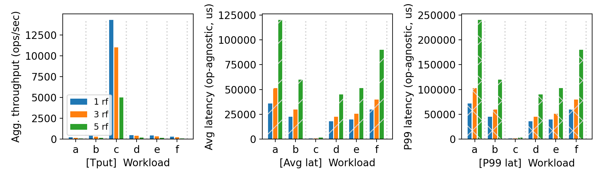
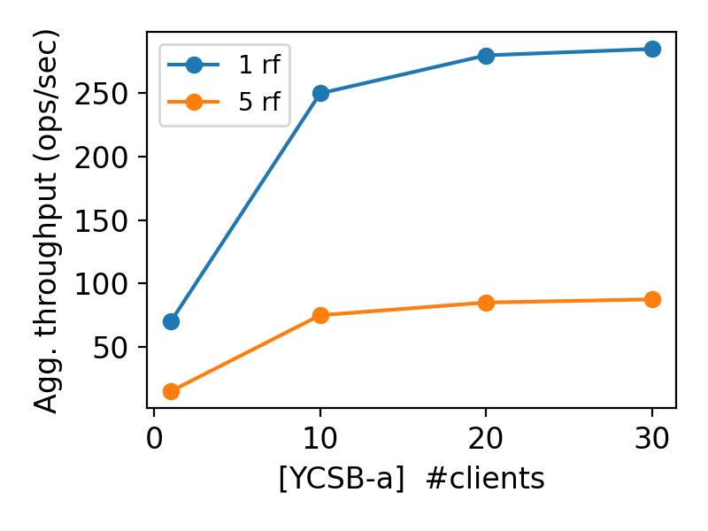

# CS 739 MadKV Project 3

**Group members**: Lekha `lravichandr2`, Avinash `kartik3`

## Design Walkthrough

The system implements Raft to replicate a key-value store across multiple replicas. A leader appends client commands to its log and replicates them via AppendEntries. Followers accept logs only if terms and previous log indices match, ensuring consistency.

Leader election is triggered via randomized election timeouts. Candidates request votes and become leader only if a majority is achieved. Commit index advances only when entries are replicated on a majority of nodes in the same term.

By including Raft, we also modified the designs for Reads and Writes:

Writes:
<ul>
<li> ⁠Check if its the current leader, as only the leader can take client requests.
<li> Append it to it’s own raft log and send the AppendRPC to all the replicas, if majority agree that this command should be applied at this index, it will commit it and apply the log command to the state machine (other replicas apply this in the bg).
<li> Send the reply back to the client and the heartbeat to the replicas updating the new commit index.
</ul>

Reads:
<ul>
<li> ⁠Check if its the current leader, as only the leader can take client requests.
<li> Reply from the state machine log.
</ul>

### Code structure & abstractions
The system is split into a RaftServer class and a KVStore service layer. RaftServer handles consensus logic, log replication, heartbeat and election, while KVStore translates client operations into Raft log entries and eventually updating the state machine itself.

Persistent state (term, voted_for, log) is stored in RocksDB. RPC communication is handled via generated gRPC stubs.

Three background threads run independently: ElectionLoop manages timer-based elections using a condition variable, and HeartbeatLoop drives log replication to peers. The KVServer replicas also has a background thread running to update it's state machine.

### Implementation

<ul>
<li> The basic message flow was pretty straightforward to get right. AppendEntries and RequestVote follow the paper closely and once we had the state transitions working the happy path just worked.
<li> The hardest part was getting the threading right. We have the election loop, heartbeat loop, state machine application thread, and incoming RPC handlers all touching shared state simultaneously.
<li> Another most challenging part of the implementation is leader election stability under failures, especially how small timing issues can cause split votes or multiple leaders if not carefully controlled. So we had to try different values for election timeout and heartbeat duration.
<li> The other really hard thing was debugging. When something goes wrong in a distributed system you can't just set a breakpoint. We spent a lot of time staring at logs trying to figure out why the leader wasn't getting elected or why commits weren't being applied.

</ul>

### How node failures are mitigated
<ul>
<li> Node failures are handled through timeouts and retries. 

<li> For follower failures, the leader just keeps retrying AppendEntries and backs off next_index on rejection, so when the follower comes back it automatically catches up.

<li> If a leader fails, followers detect missing heartbeats and trigger elections automatically. We widened the election timeout range to 300–1500ms after seeing synchronized timeouts cause back-to-back elections in our logs. 
<li> Once a new leader is elected it reinitializes next_index for all peers and replays uncommitted entries.
</ul>

## Self-provided Testcases

You will run the four described testcase scenarios during demo time.

### Explanations

<ol>
<li> Case 1: Followers can crash or disconnect without affecting availability as long as a majority remains alive. The leader continues committing entries to the quorum. When the follower recovers, it catches up via log reconciliation.
<li> Case 2: When a leader fails, followers stop receiving heartbeats and trigger elections after timeout. A new leader is elected using majority votes. The system continues processing requests after re-election with minimal interruption.
<li> Case 3: If more than half the nodes fail, the cluster becomes unavailable since no majority exists. Clients cannot commit new writes, preserving safety over availability. Once quorum is restored, normal operation resumes.
</ol>

## Fuzz Testing

<u>Parsed the following fuzz testing results:</u>

server_rf | crashing | outcome
:-: | :-: | :-:
5 | no | PASSED
5 | yes | PASSED

You may be asked to run a crashing fuzz test during demo time.

### Comments
<ol>
<li>No failures:
We observed that a leader remained mostly stable and all operations were replicated and committed consistently across replicas. Even with conflicting writes, the system preserved correctness since only the leader handled client requests and commits.

<li>With failures (2 replicas, including leader):
When two replicas (including the leader) were crashed, a new leader was elected automatically. The system continued to make progress as a majority was still alive. The crashed replicas were able to recover from persistent storage and catch up via log replication.
</ol>

## YCSB Benchmarking

<u>10 clients throughput/latency across workloads & replication factors:</u>

<u>Agg. throughput trend vs. number of clients with different replication factors:</u>

### Comments

#### Set 1:
<ul>
<li> We ran all all testing and benchmarking on a single machine due to the limited resources avaiable.
<li> Workload C (read-only) dominates throughput by a large margin compared to all other workloads. This is because the reads don't touch RocksDB's write path, don't acquire exclusive locks, and don't sync to disk. 
<li> All workloads involving writes (A, B, D, E, F) show significantly lower throughput because every write requires a synchronous RocksDB sync to disk.
<li> The throughput of workloads B, D and E are slightly better because they are majorly read traffic.
<li> The latency metrics of workload C is very negligible compared to the other workloads.
<li> Write-heavy workloads show significantly higher average and P99 latency, with P99 latency being several times higher than average latency, indicating that tail latency is disproportionately affected by disk sync operations and lock contention under concurrent writes.
<li> We can see that more the replication factor, more the latency. This is because of the time needed for raft to reach consensus.
</ul>

#### Set 2: 
<ul>
<li> With 5 as replication factor, throughput doesn't change much. It saturates after a point, and adding more clients doesn't degrade performance. This is because we need to reach consesnsus between 5 raft srevers.
<li> With 1 as replication factor however, throughput is much better as we don't need to reach consensus between multiple replicas and the request provided by the client can be committed immediately.
<li> This shows that though more replicaton gives better avaiability, it does degrade the performance.
</ul>

### Bonus content:
<ul>
<li> We were only able to do the first part mentioned, i.e. "Recovery & re-joining of failed replicas to maintain cluster size".
<li> Since we are persisting logs to RocksDB, once a server comes back up it automatically joins the cluster and raft consensus makes sure that it is caught up with the leader eventually.
</ul>

